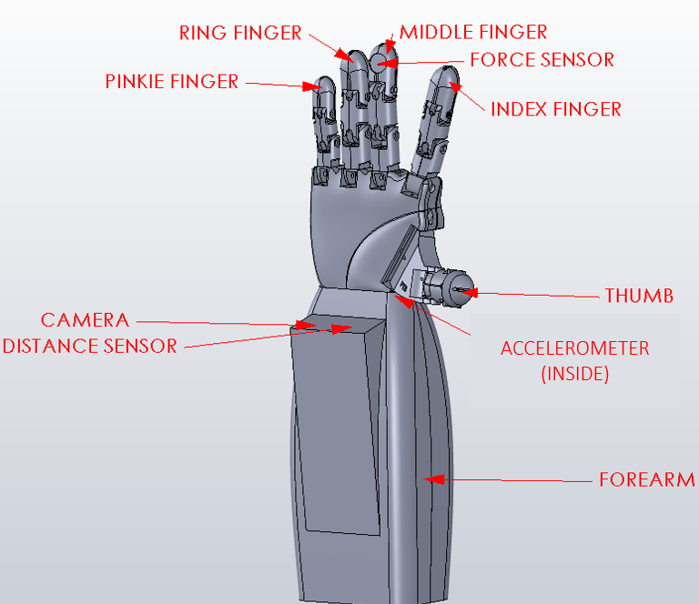
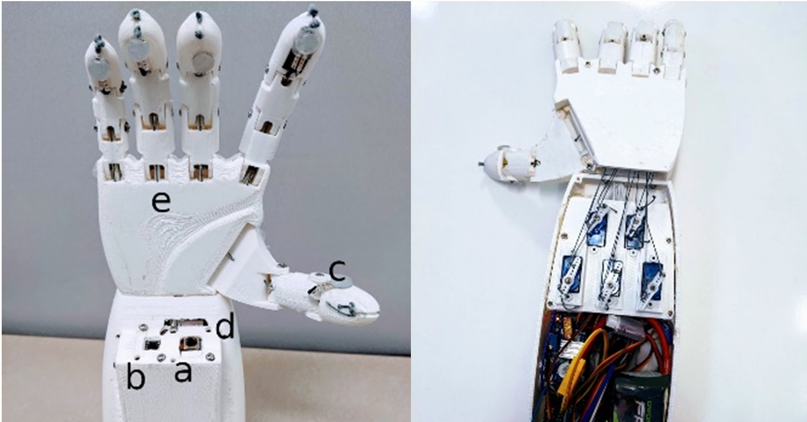

# Vision Controlled Sensorized Prosthetic Hand
This paper presents a sensorized vision-enabled prosthetic hand aimed at replicating a natural hand’s performance, functionality, appearance, and comfort. The design goal was to create an accessible substitution with a userfriendly interface requiring little to no training. Our mechanical hand uses a camera and embedded processors to perform most of these tasks. The interfaced pressure sensor is used to get pressure feedback and ensure a safe grasp of the object; an accelerometer is used to detect gestures and release the object. Unlike current EMG-based designs, the prototyped hand does not require personalized training. The details of the design, tread-off, results, and informing the next iteration are presented in this paper.

Video demonstration: https://www.youtube.com/watch?v=yInMzl4Ef7A


<b>Keywords:</b> Amputee · AI · Camera · Vision · Prosthetic Hand · Google Coral · 3D print



Figure : 3D Design of Vision-Enabled Sensorized Prosthetic Hand



Figure: (left) shows the front side of the working prototype of Vision Controlled Sensorized Prosthetic hand: (a) Camera, (b) Distance sensor, (c) Pressure sensor (FSR), (d) accelerometer (hidden inside) (e) Tendon wire. and the image (right) is the backside showing the electronic circuit and servo motor assembly

## Use mdt to push code 
``` 
mdt push /path/to/code /home/mendel/

mdt push /path/to/code /home/mendel/precedent-challange-2022/
```

## Install dependency 
```
sudo apt-get install python3-dev
pip3 install smbus 
```

# Cite the paper

```
@inproceedings{BasetSarker2022,
  author    = {M. A. Baset Sarker and Juan Pablo Sola and Aaron Jones and Evan Laing and Ernesto S. Sola and Masudul H. Imtiaz},
  title     = {Vision Controlled Sensorized Prosthetic Hand},
  booktitle = {Interdisciplinary Conference on Mechanics, Computers and Electronics (ICMECE) 2022},
  year      = {2022},
  address   = {Albany, NY, USA}
}

@misc{visionhand,
      url = {https://zenodo.org/record/7789328},
      author = {M. A. Baset Sarker},
      title = {Vision based prosthetic hand},
      publisher = {GitHub},
      journal = {GitHub repository},
      year = {2022},
}

```

